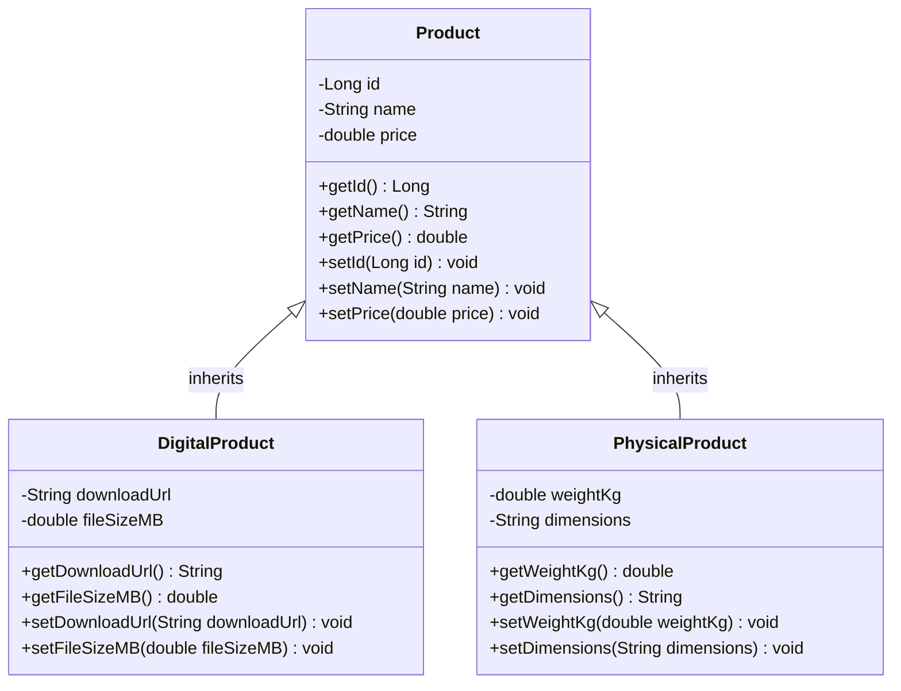

```mermaid
classDiagram
    class Product {
        -Long id
        -String name
        -double price
        +getId() Long
        +getName() String
        +getPrice() double
        +setId(Long id) void
        +setName(String name) void
        +setPrice(double price) void
    }

    class DigitalProduct {
        -String downloadUrl
        -double fileSizeMB
        +getDownloadUrl() String
        +getFileSizeMB() double
        +setDownloadUrl(String downloadUrl) void
        +setFileSizeMB(double fileSizeMB) void
    }

    class PhysicalProduct {
        -double weightKg
        -String dimensions
        +getWeightKg() double
        +getDimensions() String
        +setWeightKg(double weightKg) void
        +setDimensions(String dimensions) void
    }

    Product <|-- DigitalProduct : inherits
    Product <|-- PhysicalProduct : inherits
```